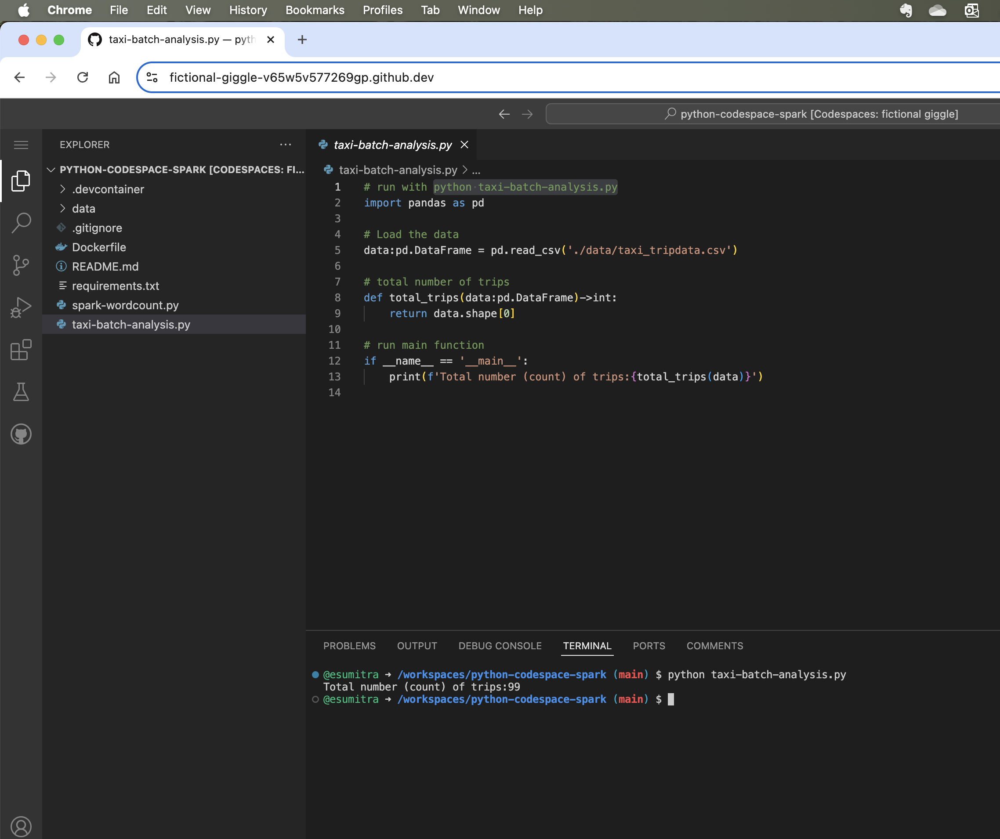
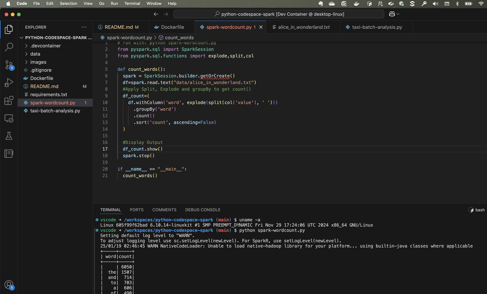
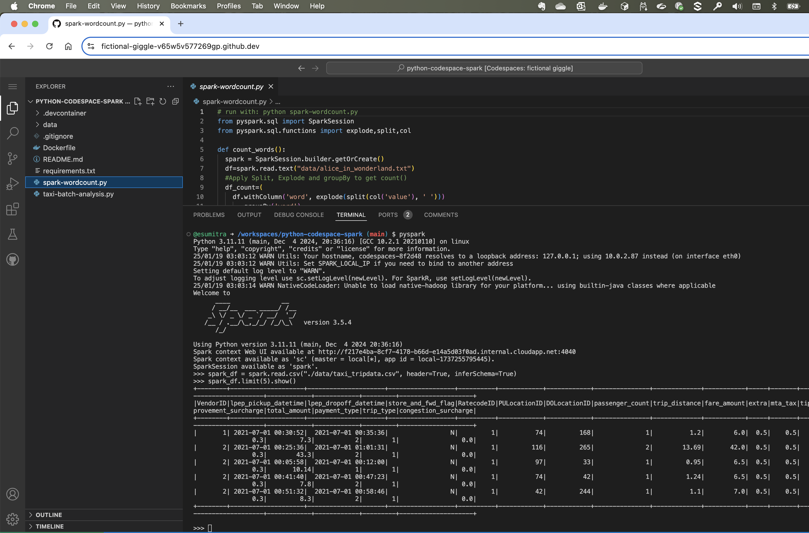

# Develop Environment for Python Data Analytics
This project illustrates simple data analytics with Python Pandas and Pyspark. The develop enviroment uses Github codespaces and Devcontainers.

The project illustrates the following kinds of data analysis
1. Run analysis locally using pandas
See [taxi-batch-analysis.py](taxi-batch-analysis.py)

2. Run analysis using a Spark job locally
See [spark-wordcount.py](spark-wordcount.py)

[](https://codespaces.new/esumitra/python-codespace-spark?quickstart=1)


## Using Codepspaces

[](./images/codespaces-pandas.png)

1. Create or Resume a Codespace

Click the "Open in Github Codespaces" button above to start the developer IDE in the cloud.

2. Start a terminal
3. Run pandas analysis
```
python taxi-batch-analysis.py
```
4. Run spark analysis
```
python spark-wordcount.py
```

**Note: Don't forget to turn off the codespace, else you will get charged for the codespace even when you are not using it.**

## Using Local Devcontainer

[](./images/devcontainer-local.png)

1. Open Visual Studio Code (VSC) editor
```
code .
```
2. Install devcontainers plugin
3. Open project in a dev container
(Cmd + Shift + P) and select `Devcontainers: Rebuild Container`
4. Start a terminal window
5. Run pandas analysis
```
python taxi-batch-analysis.py
```
6. Run spark analysis
```
python spark-wordcount.py
```

## Pyspark Interactive console

[](./images/codespaces-pyspark.png)

1. Open pyspark console
```
pyspark
```
2. Load csv file
```
spark_df = spark.read.csv("./data/taxi_tripdata.csv", header=True, inferSchema=True)
```
3. Show dataframe
```
spark_df.show()
```
4. Count rows
```
spark_df.count()
```
5. Quit console
```
quit()
```

Open spark console at http://localhost:4040/jobs/

## Using AWS cli

1. Configure AWS secrets for first time use
```
aws configure
```
At a minimum the followng keys need to be configures
```
aws_access_key_id = xxxx1
aws_secret_access_key = xxxx2
region=us-east-1
```

2. Test configuration by listing an S3 file
```
aws s3 ls s3://<path-to-file-on-s3> -
```
### Copyright
Copyright 2025, Edward Sumitra

Licensed under the MIT License.
